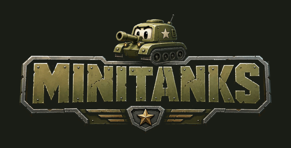

# MINITANKS

Un piccolo gioco di strategia in tempo reale (RTS) stile *Red Alert*, interamente in un singolo file HTML. Difendi il tuo quartier generale da otto ondate di nemici, conquista fabbriche, costruisci difese e sopravvivi.

**▶️ Gioca qui:** https://lmacchiavelli.github.io/minitanks/

> Sostituisci `TUONOME` con il tuo username GitHub dopo aver attivato Pages.

---

## Come si gioca

Il gioco si controlla con **mouse e tastiera** (serve un computer desktop o portatile).

| Comando | Azione |
|---|---|
| **Click sinistro** | Seleziona un carro, oppure spostalo su un punto / attacca un nemico |
| **Trascina** | Selezione di gruppo (o di una base se l'area è vuota) |
| **Doppio click** | Imposta una pattuglia tra due punti |
| **Tasto destro** | Sposta il punto di raduno della base attiva |
| **Rotella** | Zoom |
| **Barra spaziatrice** | Pausa |

### Obiettivo

Sopravvivi a **8 ondate** senza perdere l'HQ. Le ondate vengono annunciate in anticipo, con direzione e composizione.

- **Recluta carri** spendendo crediti: esploratore (veloce), carro (equilibrato), pesante (lento ma corazzato).
- **Conquista le fabbriche** neutre portandoci sopra un carro: danno più reddito e diventano punti di produzione avanzati.
- **Costruisci** torrette e barriere, e ripara le strutture danneggiate.
- In emergenza, usa il **raid aereo** (ricaricabile) o l'**atomica** (una sola volta a partita).

### Coppe

A fine partita ricevi una coppa in base a quanto sei andato avanti: 🥉 Bronzo → 🥈 Argento → 🥇 Oro → 🏆 Platino → 💎 Diamante. Il miglior risultato viene salvato localmente nel browser.

---

## Caratteristiche

- Carri, basi e avamposti con sprite illustrati
- Ondate a difficoltà variabile (4 "campagne" diverse a ogni partita)
- Nebbia di guerra
- Mappa procedurale con alberi che crollano al passaggio dei carri
- Pioggia dinamica
- Due armi speciali: raid aereo e atomica
- Audio sintetizzato (disattivabile)
- Tutorial integrato e salvataggio del record (localStorage)

---

## Tecnologia

Tutto in un **singolo file `index.html`**: nessuna dipendenza, nessun build, nessun server. Vanilla JavaScript + Canvas 2D + Web Audio API. Le immagini sono incorporate come data-URI, quindi il file è completamente autonomo.

---

## Pubblicare su GitHub Pages

1. Crea un repository pubblico (es. `minitanks`)
2. Carica il file rinominandolo **`index.html`**
3. Vai in **Settings → Pages**
4. Sotto *Source* scegli `Deploy from a branch`, branch `main`, cartella `/ (root)`, salva
5. Dopo 1-2 minuti il gioco è online all'indirizzo `https://lmacchiavelli.github.io/minitanks/`

---

## Note

- È un **esperimento giocabile**, non un prodotto commerciale: una partita dura circa 5-15 minuti.
- Funziona solo da desktop (richiede mouse e tastiera).
- Alcune risorse grafiche sono state generate con strumenti di IA.

---

*Realizzato per divertimento. Buona difesa, comandante.* 🪖
